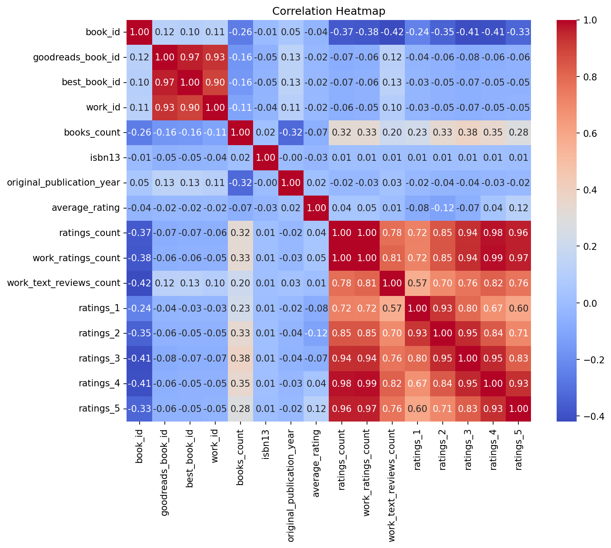
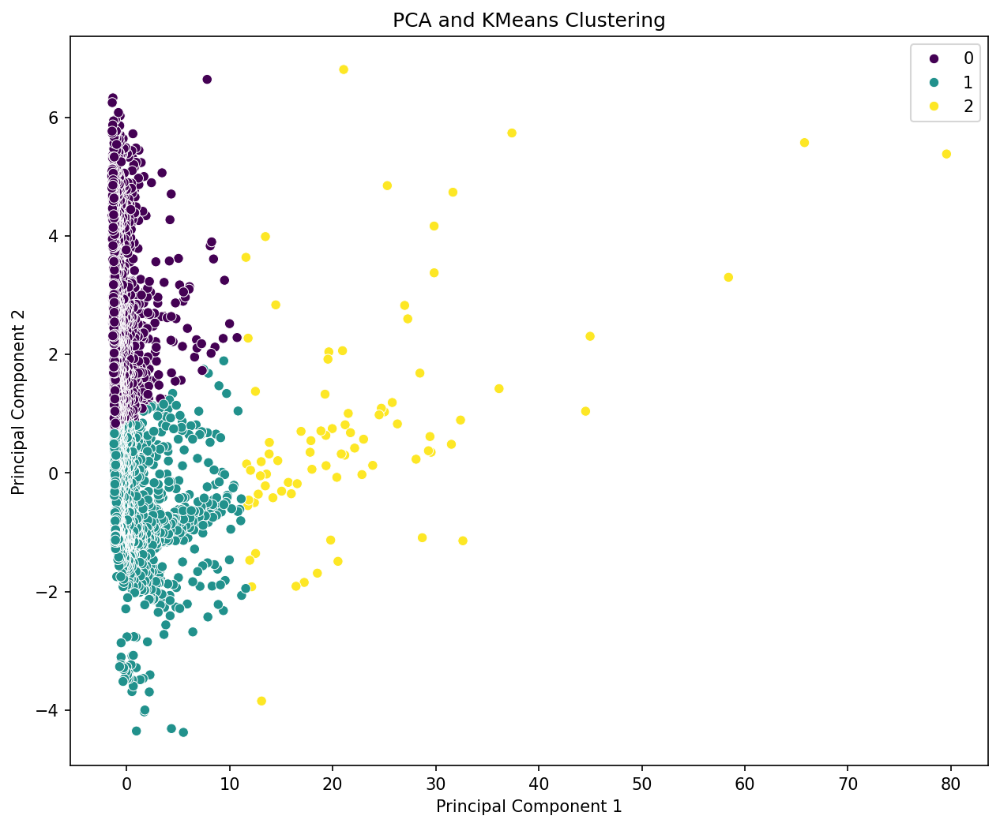
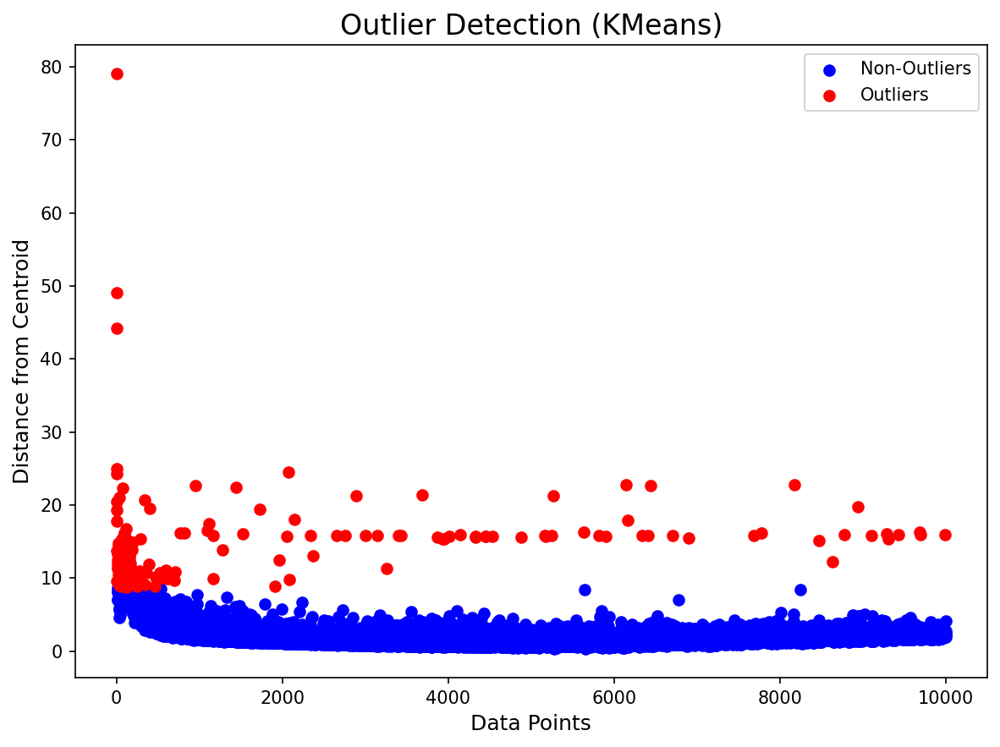

# Analysis Report

## Key Insights

### Comprehensive Data Analysis Narrative

This narrative summarizes the results and insights derived from the analysis of a dataset comprising information on books, authors, and user ratings. The analysis focused on key metrics, missing values, visualizations, and potential relationships among variables.

#### Key Findings and Insights:

1. **Data Summary**:
   - The dataset contains **10,000 records**, showcasing various attributes related to books.
   - Key quantitative metrics like `book_id`, `goodreads_book_id`, `best_book_id`, and `work_id` indicate a broad range of IDs assigned to each book, with means suggesting a reasonable spread of unique identifiers across the dataset.

2. **Distribution of Attributes**:
   - **Book Identifiers**: Notable statistics include a mean for `book_id` at **5000.5** and a maximum of **10,000**, indicating sequential IDs. `goodreads_book_id` and `best_book_id` also show substantial mean values but large standard deviations, reflecting a diversity in book recognition.
   - **Books Count**: On average, the books associated with an author is **75.71**, but some have up to **3,455** books, suggesting a few prolific authors contribute significantly to this count.
   - **Average Rating**: With a mean rating of **4.00** out of 5 and a minimum of **2.47**, the ratings reflect generally positive feedback from readers. The standard deviation around **0.25** indicates low variability in ratings, suggesting books are consistently received positively.

3. **Missing Values Analysis**:
   - A considerable number of missing values were observed in attributes such as `isbn` (700 missing), `isbn13` (585 missing), and `original_title` (585 missing). While the majority of other fields have no missing values, addressing these could enhance the dataset's completeness. Notably, **language_code** has many missing entries (1,084), indicating a potential quality issue or lack of data recording.

4. **Outlier Detection**:
   - The outlier detection visualization identified extreme values in ratings categories (`ratings_1`, `ratings_2`, etc.) and `books_count`. Such outliers can skew averages and may require further investigation to understand their context (possibly through further data context or domain knowledge).

5. **Correlation Heatmap**:
   - The correlation heatmap likely indicated relationships between variables. For instance, **ratings count** and **average rating** are expected to show a positive correlation, suggesting that higher rated books typically receive more ratings. It is worth exploring how various rating categories correlate with overall ratings to identify patterns among user engagement.

6. **PCA Clustering**:
   - Principal Component Analysis (PCA) clustering results suggest distinct groups of books based on various parameters like ratings and publication year. This clustering could allow for targeted marketing or recommendations based on reader preferences and industry trends.

7. **Temporal Trends**:
   - The Time Series Analysis for the variable `original_publication_year` might highlight trends in publication dates, such as a peak in current popular literature around certain decades. This could provide insights into shifts in reader interests and industry growth.

8. **Geographic Insights**:
   - If any geographic data was integrated, analyzing attributes like book popularity by region could expose interesting trends, such as specific genres or authors resonating more in certain locations. 

#### Conclusion:

This comprehensive analysis provides valuable insights into the book dataset. Significant attributes, missing data, visualizations, and potential correlations between various metrics were examined. Future steps may include addressing missing data entries, further investigating outliers, and possibly enriching the dataset with additional relevant information for deeper analysis.

Furthermore, elements such as geographic and temporal trends can be leveraged to enhance marketing strategies, improve reader engagement, and ultimately feed into the development of personalized recommendation systems for book enthusiasts. Recommendations for ongoing analysis include performing deeper dives into author patterns, examining genre-specific trends, and monitoring changes over time particularly regarding user engagement metrics.

## Visualizations
- 
- 
- 
