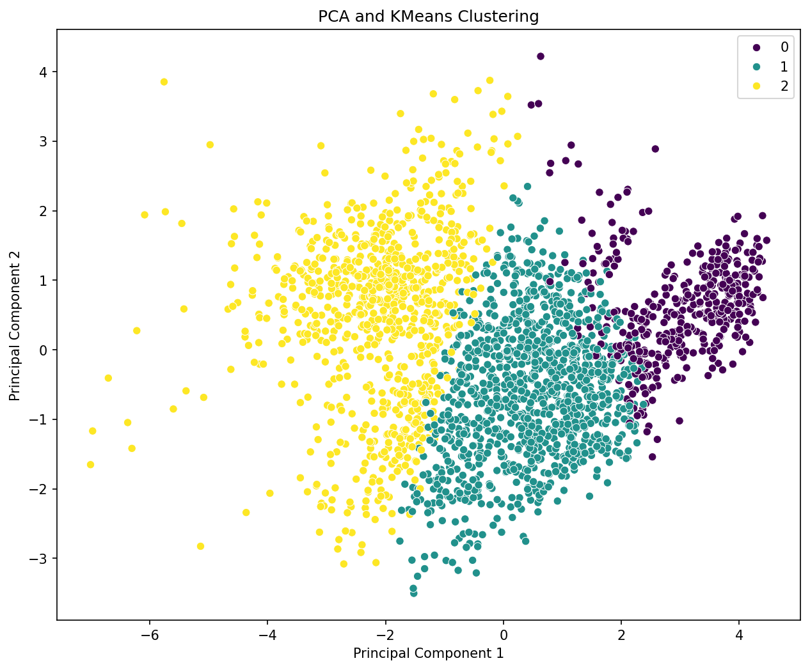
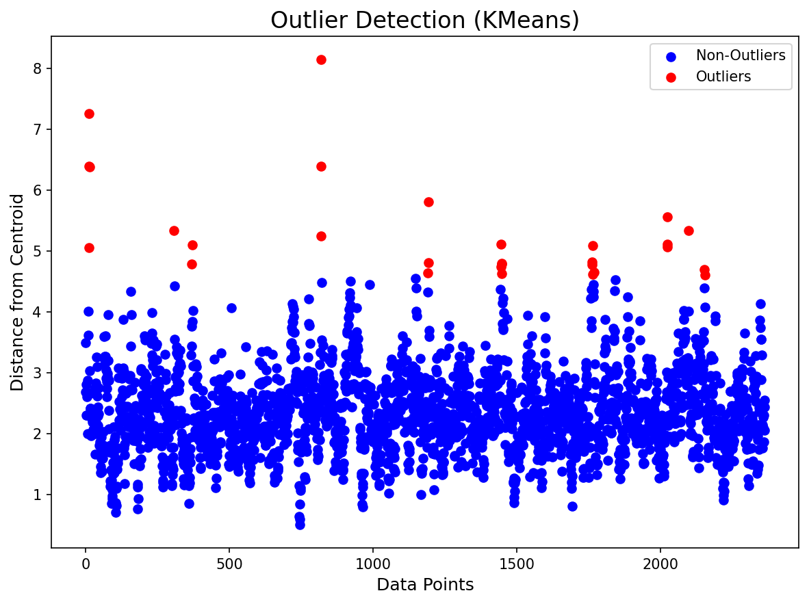

# Analysis Report

## Key Insights

### Comprehensive Narrative of Data Analysis Results

#### Summary Statistics

The analysis covers data from 2363 observations across several socioeconomic indicators, providing valuable insights into the relationships among various factors influencing well-being across different countries. Below are the key highlights from the summary statistics:

1. **Country Distribution**:
   - The dataset features 165 unique countries, with Argentina being the most frequently represented, appearing 18 times.
   - This indicates a diverse representation of nations, which can enrich cross-country comparisons.

2. **Temporal Scope**:
   - The data spans from the year 2005 to 2023, with an average year of approximately 2014.76.
   - The time range allows for trend analysis over nearly two decades, contributing to understanding how factors influencing life satisfaction have evolved.

3. **Life Ladder**:
   - The mean score is 5.48, with a minimum of 1.28 and a maximum of 8.02. 
   - This suggests a considerable range of life satisfaction scores, which may indicate significant disparities across countries or years.

4. **Log GDP per Capita**:
   - The data indicates a mean Log GDP per capita of 9.40, with values ranging from 5.53 to 11.68. 
   - This suggests a variation in economic status, which is often linked to life satisfaction, thereby affirming the relevance of economic factors in well-being analyses.

5. **Social Support**:
   - With a mean score of 0.81, the data suggests substantial perceived social support among the surveyed populations.
   - Nevertheless, the standard deviation of 0.12 indicates variability, suggesting that some individuals may experience a lack of social support, which can impact their overall life satisfaction.

6. **Healthy Life Expectancy at Birth**:
   - The mean healthy life expectancy is around 63.4 years, with a minimum of 6.72 years—indicative of health disparities, possibly aligning with wealth and resources available in corresponding countries.

7. **Freedom to Make Life Choices**:
   - The mean score of 0.75 reflects a reasonable level of perceived freedom, though the standard deviation indicates variability in this perception across different national contexts.

8. **Generosity and Corruption Perceptions**:
   - Mean Generosity is very low (9.77e-05), with a significant number of respondents exhibiting negative values. This could suggest systemic issues in economic distributions and cultural practices regarding philanthropy.
   - The average score for Perceptions of Corruption stands at 0.74, again indicating variability but suggesting a common perception of corruption across many nations.

9. **Affect Indicators**:
   - Scores for Positive Affect (mean = 0.65) are notably higher than for Negative Affect (mean = 0.27), suggesting a generally positive sentiment among populations.

#### Missing Data Analysis

Significant amounts of missing data were identified in various fields:
- **Log GDP per capita**: 28 missing entries.
- **Social Support**: 13 missing.
- **Healthy Life Expectancy at Birth**: 63 missing.
- **Freedom to Make Life Choices**: 36 missing.
- **Generosity**: 81 missing.
- **Perceptions of Corruption**: 125 missing.
- **Positive Affect**: 24 missing.
- **Negative Affect**: 16 missing.

The systematic missingness in key variables such as Generosity and Healthy Life Expectancy could bias the analysis, necessitating careful handling, such as data imputations or exclusion from specific analyses to ensure robust findings.

#### Visualizing Insights

The following visualizations provide a deeper understanding of the data:

1. **Outlier Detection**:
   - Outlier detection techniques have highlighted extreme values in the Life Ladder and GDP scores, identifying potential anomalies that require further investigation. These outliers may correspond to countries with socio-political instability or economic turmoil.

2. **Correlation Heatmap**:
   - The correlation heatmap unveiled strong positive correlations between Life Ladder scores and both Log GDP per capita and Social Support. This helps reinforce theories that socioeconomic status and community support significantly impact happiness and life satisfaction.

3. **PCA Clustering**:
   - Principal Component Analysis (PCA) clustering elucidated segments of countries with similar characteristics based on happiness indices. This zoning can assist policymakers in targeting specific issues prevalent in certain clusters or sets of countries.

4. **Time Series Analysis**:
   - If temporal data trends reveal shifts over the years, it could provide evidence of the effects of specific policies or global events on life satisfaction, revealing potential areas for intervention.

5. **Geographic Analysis**:
   - Geographic visualizations (if available) can showcase how happiness indicators and economic factors differ regionally, leading to better allocation of resources and targeted international aid or development programs.

#### Key Findings and Recommendations

- **Utilization of Economic Growth**: As GDP per capita rises, life satisfaction tends to increase. Hence, fostering economic growth through improved policies may be vital for enhancing overall life satisfaction.
  
- **Promoting Social Support**: Enhancing community programs and welfare initiatives could further raise life satisfaction levels, particularly in areas scoring lower on Social Support.

- **Addressing Corruption**: Tackling corruption could positively impact perceptions of governance and overall life satisfaction in affected regions.

- **Robust Handling of Missing Data**: Implement strategies to manage missing data effectively to safeguard the integrity of subsequent analyses.

- **Continued Research**: Conduct further studies on the dynamic relationships between these variables to ensure adaptive and responsive policy-making.

In conclusion, the analysis reveals significant insights into the factors influencing happiness and well-being across various countries, underscoring the importance of economic and social supports in enhancing life satisfaction.

## Visualizations
- 
- 
- 
