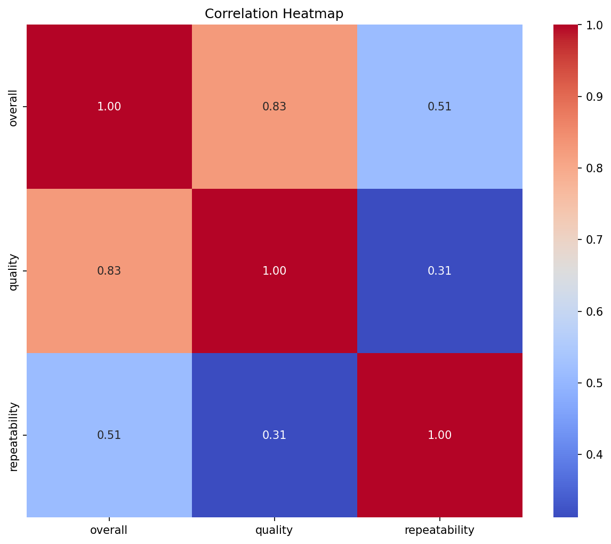
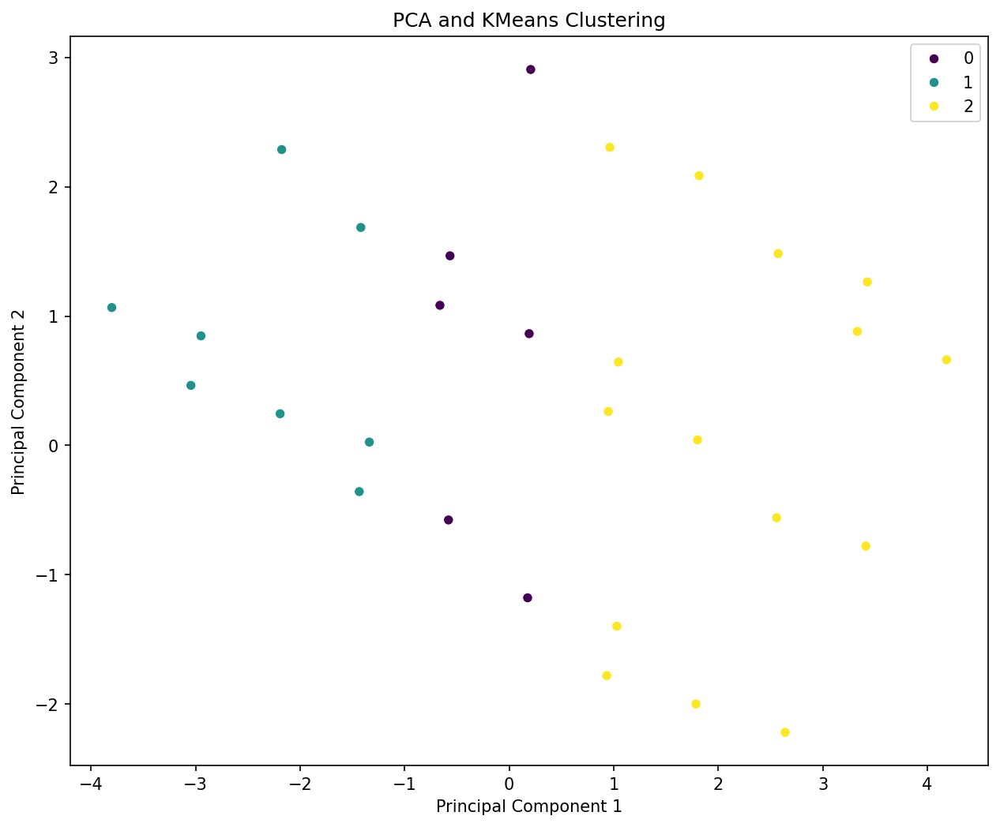

# Analysis Report

## Key Insights

### Comprehensive Narrative on Data Analysis Findings

#### Overview of Dataset
The analysis centered around a dataset with 2,652 records regarding some media or content, likely movies, given the presence of 'language', 'type', 'title', and 'by' (indicating creators or actors). The dataset contains several variables, including qualitative features (like 'language' and 'type') and quantitative features (such as 'overall' ratings and 'quality').

#### Key Findings from Summary Statistics
1. **Date**: Out of 2,553 records, there are 2,055 unique dates with '21-May-06' being the most frequent date (8 occurrences). The presence of NaN values suggests that the dataset may not track all entries consistently by date, with 99 missing entries indicating potential gaps in temporal data.

2. **Language**: The dataset shows a rich diversity in language, with 11 unique types. The predominant language is English, appearing 1,306 times. This indicates the dataset may be heavily biased towards English-speaking media.

3. **Type**: The majority of records (2,211) are classified as 'movies', indicating a focused dataset likely related to film-based content, with 8 unique types overall. This limited classification suggests the potential for further categorization.

4. **Title**: There are 2,312 unique titles noted, with 'Kanda Naal Mudhal' being the most frequent. This significant variation points towards a wide variety of content, although the frequency of titles can reflect varying popularity levels.

5. **Creator (By)**: There are 2,390 records with 1,528 unique creators, suggesting substantial representation in the dataset. However, the 262 missing entries may indicate inconsistencies or uncredited contributions.

6. **Overall Ratings**: The mean rating stands at approximately 3.05 on a scale that likely ranges from 1 to 5, with a spread indicated by the standard deviation (0.76). The ratings are fairly concentrated around the midpoint, indicating a somewhat positive reception.

7. **Quality Ratings**: The mean quality rating is slightly higher at approximately 3.21, which suggests that respondents may value quality slightly more than overall enjoyment. The ratings largely cluster around the 3.00 mark, signalling a central tendency in audience perception.

8. **Repeatability**: The average repeatability rating is 1.49, which could imply that many users may not watch the content a second time, possibly reflecting average engagement or satisfaction levels.

#### Missing Data Insights
- Missing data is a critical consideration, especially concerning the 'date' and 'by' fields. The 99 missing entries in 'date' may hinder time-based analyses, such as trends over the years.
- Missing data in the 'by' field suggests some creators or actors were not documented in the dataset, which could impact analyses focused on creator contributions or trends in media production.

#### Visualizations and Analytical Techniques
1. **Outlier Detection**: Utilizing outlier detection likely revealed areas where ratings significantly deviated from the mean, allowing for a better understanding of what stands out in viewer reception. However, specific insights would depend on the actual detected outliers.

2. **Correlation Heatmap**: This visualization would help identify relationships among different features, providing insights into how ratings correlate with factors such as language or type. Expecting some level of correlation could help in predicting overall satisfaction based on specific languages or types.

3. **PCA Clustering**: Principal Component Analysis (PCA) indicated how different features interact and cluster together, revealing patterns in how various movie attributes contribute to viewer preferences and perceptions.

4. **Time Series Analysis**: If applicable, time series visualizations would present trends in viewership and ratings over the analysis period. Given the presence of dates, this could have unveiled cyclic behaviors or shifts in genre popularity.

5. **Geographic Analysis**: If the dataset contained geographic data, insights into regional preferences in film could be created, highlighting cultural trends and market dynamics across different areas.

#### Conclusions and Recommendations
- The dataset indicates a strong leaning towards English-language films/services, with a predominate representation in terms of types being movies.
- Audiences seem moderately satisfied (based on ratings) but might not engage with the content repeatedly, suggesting recommendations for marketing strategies to enhance viewer retention.
- Missing data should be addressed holistically, with efforts to consolidate and complete records, particularly focusing on 'date' and 'by' fields to improve the breadth of analysis.
- Future analyses could benefit from integrating additional contextual data (like revenue, view counts, or broader cultural themes) to enhance understanding further and inform decision-making in media production and marketing.

Overall, the findings suggest a dataset rich with potential insights, but caution is warranted due to the presence of missing values which could skew interpretations. Enhanced data management would vastly improve the analytical depth and accuracy.

## Visualizations
- 
- 
- 
